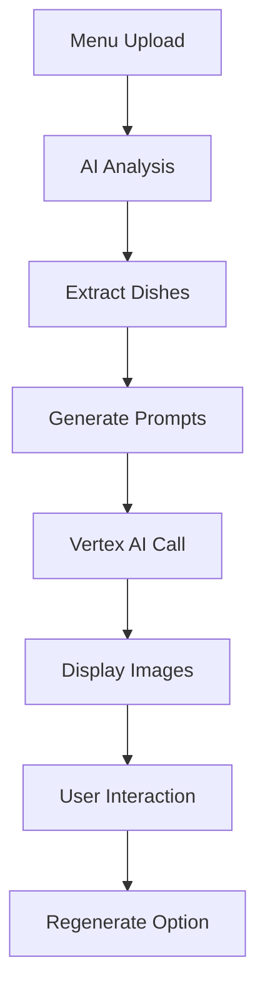

# Vertex AI Image Generation Integration

This document explains how to set up and use Google Cloud Vertex AI's Imagen model for generating realistic food images in NutriWise.

## 🎯 Overview

After a menu is analyzed and dishes are recommended by the AI, the app uses Google Cloud Vertex AI's `imagegeneration@006` model to generate realistic food images for each suggested dish. The integration includes:

- **Backend Server**: Express.js server that handles Vertex AI API calls
- **Authentication**: Service account-based authentication with base64 encoded credentials
- **Frontend Component**: React component with loading states and error handling
- **Menu Integration**: Automatic image generation for recommended dishes

## 🛠️ Prerequisites

1. **Google Cloud Project** with Vertex AI API enabled
2. **Service Account** with "Vertex AI User" permissions
3. **Service Account JSON key** downloaded
4. **Google Cloud billing** enabled (Vertex AI is a paid service)

## 🚀 Quick Setup

Run the automated setup script:

```bash
./setup-vertex-ai.sh
```

This will:
- Install server dependencies
- Configure environment variables
- Set up authentication
- Test the configuration

## 📋 Manual Setup

### 1. Google Cloud Configuration

#### Enable Vertex AI API
```bash
gcloud services enable aiplatform.googleapis.com
```

#### Create Service Account
```bash
gcloud iam service-accounts create nutriwise-vertex-ai \\
    --display-name="NutriWise Vertex AI Service Account"
```

#### Grant Permissions
```bash
gcloud projects add-iam-policy-binding YOUR_PROJECT_ID \\
    --member="serviceAccount:nutriwise-vertex-ai@YOUR_PROJECT_ID.iam.gserviceaccount.com" \\
    --role="roles/aiplatform.user"
```

#### Create JSON Key
```bash
gcloud iam service-accounts keys create credentials.json \\
    --iam-account=nutriwise-vertex-ai@YOUR_PROJECT_ID.iam.gserviceaccount.com
```

### 2. Backend Server Setup

#### Install Dependencies
```bash
cd server
npm install
```

#### Configure Environment
Create `server/.env`:
```env
GOOGLE_CLOUD_PROJECT_ID=your-project-id
GOOGLE_CREDENTIALS_BASE64=base64-encoded-credentials-here
PORT=3001
NODE_ENV=development
```

To encode credentials:
```bash
base64 -w 0 credentials.json
```

#### Start Server
```bash
npm start
```

### 3. Frontend Configuration

Add to `.env`:
```env
VITE_VERTEX_AI_API_URL=http://localhost:3001
```

## 🔧 API Endpoints

### Generate Food Image
```http
POST /api/generate-food-image
Content-Type: application/json

{
  "dishName": "Spicy Punjabi Chole with Basmati Rice",
  "description": "Traditional chickpea curry with aromatic rice",
  "cuisineType": "indian",
  "plating": "traditional"
}
```

### Health Check
```http
GET /api/health
```

### Test Authentication
```http
GET /api/test-auth
```

## 🎨 Image Generation Process

1. **Menu Analysis**: User uploads menu image or text
2. **Dish Extraction**: AI extracts recommended dishes from analysis
3. **Prompt Creation**: Enhanced prompts created for each dish
4. **Vertex AI Call**: Request sent to `imagegeneration@006` model
5. **Image Display**: Generated images displayed with dish details

### Prompt Engineering

The system creates detailed prompts like:
```
A professional food photography shot of Spicy Punjabi Chole with Basmati Rice, 
traditional chickpea curry served with aromatic basmati rice, served on traditional 
copper or brass tableware with vibrant spices visible, with authentic cultural 
presentation. Shot with professional lighting, shallow depth of field, appetizing 
colors, high resolution, food photography style, studio lighting, detailed textures, 
commercial quality
```

## 🎛️ Component Usage

```tsx
import { VertexAIImageGenerator } from './components/VertexAIImageGenerator';

<VertexAIImageGenerator
  dishName="Grilled Salmon with Quinoa"
  description="Fresh Atlantic salmon with organic quinoa"
  cuisineType="modern"
  plating="elegant"
  onImageGenerated={(imageUrl) => console.log('Generated:', imageUrl)}
  onError={(error) => console.error('Error:', error)}
/>
```

## 🔒 Security

### Credential Management
- **Development**: Base64 encoded in `server/.env`
- **Production**: Netlify environment variables
- **Never commit**: Add `.env` to `.gitignore`

### Temporary File Handling
```javascript
// On server startup
const credentialsPath = '/tmp/credentials.json';
fs.writeFileSync(credentialsPath, credentialsJson);
process.env.GOOGLE_APPLICATION_CREDENTIALS = credentialsPath;
```

### Environment Variables
```env
# For Netlify deployment
GOOGLE_CLOUD_PROJECT_ID=your-project-id
GOOGLE_CREDENTIALS_BASE64=your-base64-credentials
```

## 🐛 Troubleshooting

### Common Issues

#### Authentication Errors
```bash
# Test authentication
curl http://localhost:3001/api/test-auth
```

#### Server Not Starting
```bash
# Check logs
npm start
```

#### Image Generation Fails
- Check project billing is enabled
- Verify Vertex AI API is enabled
- Ensure service account has proper permissions

### Debug Logging
```env
DEBUG=vertex-ai:*
```

## 💰 Cost Optimization

### Vertex AI Pricing
- Imagen generations: ~$0.02 per image
- Implement caching to reduce costs
- Consider rate limiting for production

### Caching Strategy
```javascript
// Cache generated images
const imageCache = new Map();
if (imageCache.has(dishName)) {
  return imageCache.get(dishName);
}
```

## 🚀 Deployment

### Netlify Configuration
1. Set environment variables in Netlify dashboard
2. Deploy backend to serverless function or separate service
3. Update `VITE_VERTEX_AI_API_URL` to production URL

### Docker Deployment
```dockerfile
FROM node:18-alpine
WORKDIR /app
COPY server/ .
RUN npm install
EXPOSE 3001
CMD ["npm", "start"]
```

## 📊 Monitoring

### Health Checks
- `/api/health` - Server status
- `/api/test-auth` - Authentication status

### Logging
```javascript
console.log('🍽️ Generating image for:', dishName);
console.log('✅ Image generated successfully');
console.error('❌ Error generating image:', error);
```

## 🎯 Features

- ✅ **Automatic Generation**: Images generated for recommended dishes
- ✅ **Loading States**: Beautiful loading animations
- ✅ **Error Handling**: Graceful fallbacks and retry options
- ✅ **Responsive Design**: Works on all device sizes
- ✅ **Cuisine-Aware**: Different styling based on cuisine type
- ✅ **Professional Quality**: High-resolution, commercial-grade images

## 📱 User Experience

1. User uploads menu image
2. AI analyzes and recommends dishes
3. Automatic image generation begins
4. Loading state with progress indicators
5. Generated images displayed with dish details
6. Option to regenerate if needed

## 🔄 Integration Flow



This integration provides a seamless experience where users get beautiful, realistic food images automatically generated based on AI menu analysis, enhancing the visual appeal and usefulness of the nutrition recommendations.
